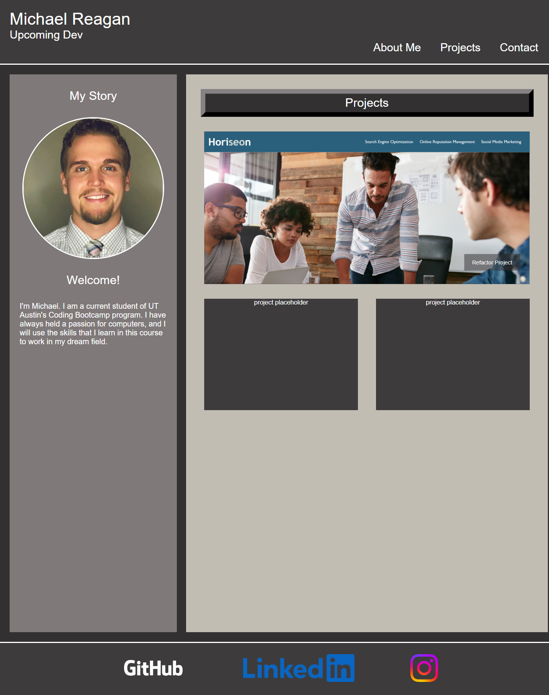

# My Portfolio

This website is a home page for my personal coding portfolio. It is my first project that I wrote from scratch, and I will use the knowledge gained throughout Coding Bootcamp and in my professional career.

## Installation and links

To navigate to my portfolio, open a browser on your computer or device and enter: 

https://mcreagan.github.io/MCReagan/.

To open locally, open VSCode or other code editing software and access repository at the following URL:

https://github.com/MCReagan/MCReagan

## Screenshots

# Features

- Page auto-adjusts according to viewer screen size
- Links in header direct user to relevant sections of webpage
- Links in header change color when user hovers over them
- Links in footer direct user to external social media accounts

## License

[MIT](https://choosealicense.com/licenses/mit/)

